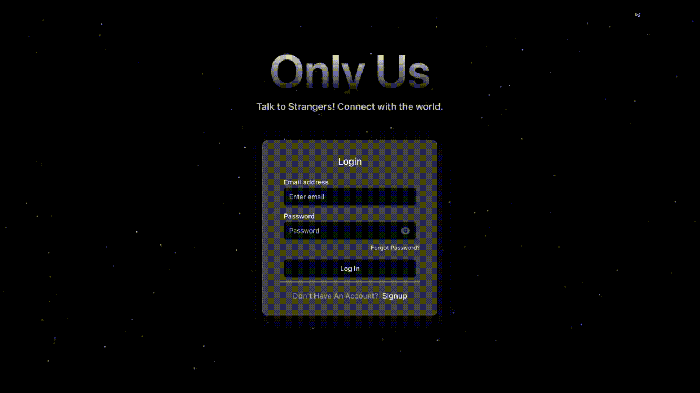

# Only Us

Welcome to Only Us! This project is a real-time chat application built with React, Firebase, and Socket.io. It allows users to send and receive messages instantly, manage friend requests, and enjoy a seamless chatting experience.

## Table of Contents

- [Features](#features)
- [Getting Started](#getting-started)
    - [Prerequisites](#prerequisites)
    - [Installation](#installation)
    - [Running the App](#running-the-app)
- [Project Structure](#project-structure)
- [Available Scripts](#available-scripts)
- [Screenshot](#screenshot)
- [Configuration](#configuration)
- [Contributing](#contributing)
- [License](#license)

## Features

- **Real-time Messaging:** Send and receive messages instantly.
- **Anonymous Chat:** Chat with people without revealing your identity.
- **Friend List:** View and manage your list of friends.
- **Friend Requests:** Accept or decline friend requests.
- **User Authentication:** Secure login with Firebase.
- **Responsive Design:** Optimized for both desktop and mobile devices.
- **Notifications:** Get notified of new messages and friend requests.
- **Customizable Profile:** Update your profile picture and status.

## Getting Started

### Prerequisites

Before you begin, ensure you have the following installed:

- [Node.js](https://nodejs.org/) (v20 or later)
- [npm](https://www.npmjs.com/) (v10 or later)

### Installation

1. Clone the repository:

    ```sh
    git clone https://github.com/Rahul-Sahani04/only-us-frontend.git
    cd only-us-frontend
    ```

2. Install the dependencies:

    ```sh
    npm install
    ```

### Running the App

1. Create a [`.env`]("https://github.com/Rahul-Sahani04/only-us-frontend/.env") file in the root directory and add your Firebase configuration:

    ```env
    REACT_APP_API_KEY=your_api_key
    REACT_APP_AUTH_DOMAIN=your_auth_domain
    REACT_APP_DATABASE_URL=your_database_url
    REACT_APP_PROJECT_ID=your_project_id
    REACT_APP_STORAGE_BUCKET=your_storage_bucket
    REACT_APP_MESSAGING_SENDER_ID=your_messaging_sender_id
    REACT_APP_APP_ID=your_app_id
    ```

2. Start the development server:

    ```sh
    npm start
    ```

3. Open [http://localhost:3000](http://localhost:3000) to view it in your browser.

## Project Structure

```
only-us-frontend/
├── public/
│   ├── index.html
│   ├── manifest.json
│   └── robots.txt
├── src/
│   ├── assets/
│   ├── components/
│   │   ├── Avatar.js
│   │   ├── ChatComponent.js
│   │   ├── ChatsContainerComponent.js
│   │   ├── Config_Firebase.js
│   │   ├── FriendsDrawer.js
│   │   ├── GradientBG.js
│   │   ├── Message.js
│   │   ├── NewUpdatedComponent.js
│   │   ├── ParticlesBackground.js
│   │   ├── ProfileCard.js
│   │   └── UserSideBar.js
│   ├── css/
│   ├── lib/
│   ├── pages/
│   │   └── Home.js
│   ├── raw_components/
│   ├── App.css
│   ├── App.js
│   ├── App.test.js
│   ├── index.css
│   ├── index.js
│   ├── reportWebVitals.js
│   └── setupTests.js
├── .env
├── .gitignore
├── bun.lockb
├── package.json
├── postcss.config.js
├── README.md
└── tailwind.config.js
```

## Available Scripts

In the project directory, you can run:

### `npm start`

Runs the app in development mode.\
Open [http://localhost:3000](http://localhost:3000) to view it in your browser.

### `npm test`

Launches the test runner in interactive watch mode.\
See the section about [running tests](https://facebook.github.io/create-react-app/docs/running-tests) for more information.

### `npm run build`

Builds the app for production to the `build` folder.\
It correctly bundles React in production mode and optimizes the build for the best performance.

### `npm run eject`

**Note: this is a one-way operation. Once you [`eject`], you can't go back!**

If you aren't satisfied with the build tool and configuration choices, you can [`eject`] at any time. This command will remove the single build dependency from your project.

## Screenshot

### Login Page



## Configuration

To configure Firebase, update the [`src/components/Config_Firebase.js`]("/src/components/Config_Firebase.js") file with your Firebase project details.

```js
const firebaseConfig = {
    apiKey: process.env.REACT_APP_API_KEY,
    authDomain: process.env.REACT_APP_AUTH_DOMAIN,
    databaseURL: process.env.REACT_APP_DATABASE_URL,
    projectId: process.env.REACT_APP_PROJECT_ID,
    storageBucket: process.env.REACT_APP_STORAGE_BUCKET,
    messagingSenderId: process.env.REACT_APP_MESSAGING_SENDER_ID,
    appId: process.env.REACT_APP_APP_ID
};
```

## Contributing

Contributions are welcome! Please read the [contributing guidelines](CONTRIBUTING.md) first.

## License

This project is licensed under the MIT License. See the [LICENSE](LICENSE) file for details.

---

Thank you for using Only Us! If you have any questions or feedback, feel free to open an issue or contact us. Happy chatting!